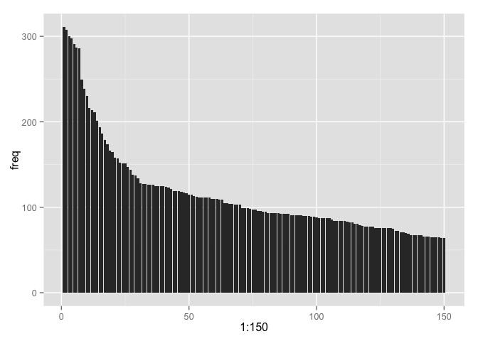

# Common errors in R: An Empirical Investigation
Noam Ross  
March 23, 2015  


**tl; dr: Most errors in R are due to looking for something that isn't there.**

*(Comment in the issues [here](https://github.com/noamross/zero-dependency-problems/issues/19)!)*

In my project to [teach problem-solving skills in R](https://github.com/noamross/zero-dependency-problems), one area that has come
up is teaching [interpretation of common error messages](https://github.com/noamross/zero-dependency-problems/issues/7).  R has
notoriously difficult to decipher error messages.

Experienced users and instructors can come up with a list of common error
messages to teach, but how can one put oneself in a novice's shoes, and understand
what errors they have trouble understanding?

One approach is to look at forums such as [Stack Overflow](http://stackoverflow.com/),
where people ask questions about programming problems.
I spent some time clicking around looking for useful teaching examples.  It's actually
hard to find *novice* questions, though, because the site does its best
to direct people towards well-formed questions and answers. This is incredibly
useful when one is searching for answers, but it gives less of a view into what
kinds of problems people post onto the site.  The "long tail" of specialty
and poorly-formed questions is both harder to navigate and too big to read manually.

Thankfuly, Stack Overflow has a great API, and [David Robinson](http://varianceexplained.org/)
has written a great R package, [stackr](https://github.com/dgrtwo/stackr), to
access it.  Here I use stackr to find the most common types of error messages
R users post about on Stack Overflow.

First, get set up:


```r
#devtools::install_github("dgrtwo/stackr")
library(stackr)
library(stringi)
library(magrittr)

#Sys.setenv(STACK_EXCHANGE_KEY = "XXXXX") <-- Get a key or you'll hit the API
#                                             See the stackr README

set.seed(0)
```


I searched the  `[r]` tag on SO for any questions with the word "Error" and got
[almost 20,000 results](http://stackoverflow.com/search?q=%5Br%5D+%22Error%22),
so I use stackr to repeat this query in R, making sure I repeat enough times
to get all the data, and return the full text of the questions with 
`filter="withbody"`.


```r
results = stack_search(tagged = "r", body = "Error", filter="withbody",
                       pagesize=100, num_pages=200)
```

Extracting the error messages is a bit tricky. People copy and paste messages
in all sorts of ways, especially beginners.  After some trial and error, I came
up with a regex filter that grabs R error messages pretty well:


```r
errors = stri_extract_all_regex(results$body,
  'Error[^:]*:.+?(?=(\\n\\n|In addition|Warning|</p>|</code>|</pre>|</blockquote>))',
   opts_regex=stri_opts_regex(mutliline=TRUE, dotall=TRUE))

errors = na.omit(unlist(errors))
errors = stri_replace_last_regex(errors, "\\n$", "")

length(errors)
```

```
## [1] 10664
```

```r
length(unique(errors))
```

```
## [1] 9604
```

Now we have a list of over 10,000 errors, but how to derive some insight from
them?  The vast majority are unique because R uses some part of the command
in the error message itself.  I decided to use [n-grams](http://en.wikipedia.org/wiki/N-gram),
specifically, trigrams, to look at the most frequent word combinations in the error messages:


```r
trigrams = lapply(
  stri_split_regex(errors, "\\s+"),
  function(x) {
    len = length(x)
    if(length(x) < 3) return(NA)
    paste(x[1:(len-2)], x[2:(len-1)], x[3:len])
  }
)

trigram_freqs = table(unlist(trigrams)) %>%
  sort(decreasing = TRUE) %>%
  data.frame(trigram=names(.), freq = ., stringsAsFactors=FALSE)

rownames(trigram_freqs) = NULL
```

We can plot the distribution of trigrams.  Here are the top 100:


```r
library(ggplot2)
ggplot(trigram_freqs[1:150,], aes(x = 1:150, y=freq)) + geom_bar(stat = "identity")
```

 

There's a long tail, but the first 30 or so are more frequent than the rest. If
we search for these trigrams across all the errors, we find they actually cover
a substantial portion:


```r
tri_regex = paste0("(", paste0(trigram_freqs$trigram[1:30], collapse="|"), ")") %>%
  stri_replace_all_fixed("(", "\\(") %>%
  stri_replace_all_fixed(")", "\\)")
sum(stri_detect_regex(errors, tri_regex))/length(errors)
```

```
## [1] 0.2171793
```

So more than 20% of the Stack Overflow R questions with "Error" contain one of
these first 30 trigrams.  Let's look at some of them:


```r
head(trigram_freqs, 15)
```

```
##                      trigram freq
## 1          not find function  311
## 2                Error in if  308
## 3             could not find  300
## 4       in eval(expr, envir,  298
## 5  eval(expr, envir, enclos)  291
## 6           envir, enclos) :  287
## 7        Error in eval(expr,  286
## 8                  = TRUE) :  249
## 9     value where TRUE/FALSE  239
## 10       missing value where  230
## 11             : cannot open  216
## 12           : missing value  214
## 13          enclos) : object  211
## 14   where TRUE/FALSE needed  201
## 15               : unable to  194
```

If you squint you might understand what these trigrams mean, but a better way to
understand them is to look up a sample of error messages from which they come.


```r
errors[stri_detect_fixed(errors, "not find function")] %>%
  sample(10) %>% cat(sep="\n---\n")
```

```
## Error : .onLoad failed in loadNamespace() for 'mzR', details:
##   call: value[[3L]](cond)
##   error: failed to load module Ramp from package mzR
## could not find function "errorOccured"
## Error: package/namespace load failed for ‘mzR’    
## ---
## Error: could not find function "performance"
## ---
## Error in all functions e.g. build.mim or minet which utilise discretize. I can run build.mim successfully without including discretize.</p>
## 
## <p>In addition, I am getting errors if I use minet (whilst excluding the discretize argument) with any of the mi.* estimation methods, e.g.</p>
## 
## <pre><code>&gt; res&lt;-minet(syn.data,"mrnet","mi.empirical","equal width",10)
## Error in build.mim(dataset, estimator, disc, nbins) : 
##   could not find function "mutinformation"
## ---
## Error in eval(expr, envir, enclos) : 
##   could not find function ".getNamespace"
## ---
## Error: could not find function "comCreateObject"
## ---
## Error in model.frame.default(formula = y ~ female + DNC + SE_region +  : 
##   could not find function "function (object, ...) \nobject"
## ---
## Error in scale$labels(breaks) : could not find function "trans"
## ---
## Error in `[.data.frame`(pm, where(pm$county == mycounties[i]), 2:48) : 
##   could not find function "where"
## ---
## Error in tmPlot(data, index = index, vSize = vSize) : 
##   could not find function "brewer.pal"
## ---
## Error in do.call(theme, list(...)) : could not find function "unit"
```

The most frequent error is "could not find function", which is generally due to
either misspelling or failure to load a package properly.


```r
errors[stri_detect_fixed(errors, "Error in if")] %>%
  head(10) 
```

```
##  [1] "Error in if (str_count(string = f[[j]], pattern = \"\\\\S+\") == 1) { : \n  argument is of length zero"                                               
##  [2] "Error in if (file.exists(sourceName)) { : argument is of length zero"                                                                                 
##  [3] "Error in if (sigma2$id &lt; 0) stop(paste(\"the estimated variance of the\",  : \n  missing value where TRUE/FALSE needed</em></strong>"              
##  [4] "Error in if ((fn(kVec, tVec, b) * fn(kVec, tVec, a) &gt; 0) | (b &gt; a)) { : \n  argument is of length zero\""                                       
##  [5] "Error in if (requir[y] &gt; supply[x]) { : \nmissing value where TRUE/FALSE needed"                                                                   
##  [6] "Error in if (d &lt; delta) { : missing value where TRUE/FALSE needed"                                                                                 
##  [7] "Error in ifelse(test == \"TRUE\", timeNdayOnOrAfter(as.Date(Sys.time()),  : \n  incompatible types (from S4 to logical) in subassignment type fix "   
##  [8] "Error in if (inherits(X[[j]], \"data.frame\") &amp;&amp; ncol(xj) &gt; 1L) X[[j]] &lt;- as.matrix(X[[j]]) : \n  missing value where TRUE/FALSE needed"
##  [9] "Error in if (code == lcode) { : argument is of length zero"                                                                                           
## [10] "Error in if (.global.summary[i] == TRUE) { : \n  missing value where TRUE/FALSE needed"
```

"Error in if" generally means the logical statement in "`if (XXX) { ...`" is not
yielding a logical value.  Most of these have `missing value where TRUE/FALSE
needed`, meaning that the variable in the `if` statement can't be found.

"could not find" seems to be of the same category as "not find function".

The next four trigrams all seem to come from the same type of error message.


```r
errors[stri_detect_fixed(errors, "in eval(expr, envir,")] %>%
  sample(10) %>% cat(sep="\n---\n")
```

```
## Error in eval(expr, envir, enclos) : object 'x' not found
## ---
## Error in eval(expr, envir, enclos) : could not find function "sentDetect"
## ---
## Error in eval(expr, envir, enclos) : object 'X18+X2' not found
## Called from: eval(expr, envir, enclos)
## ---
## Error in eval(expr, envir, enclos) : object 'id' not found
## ---
## Error in eval(expr, envir, enclos) : object 'opts_chunk' not found
## Calls: &lt;Anonymous&gt; ... in_dir -&gt; inline_exec -&gt; withVisible -&gt; eval -&gt; eval
## Execution halted
## ---
## Error in eval(expr, envir, enclos) : object '1005_at' not found
## ---
## Error in eval(expr, envir, enclos) : The Shiny package was not found
##   in the library. Ensure that Shiny is installed and is available in the
##   Library of the user you're running this application as. Calls: local
##   -> eval.parent -> eval -> eval -> eval -> eval Execution halted
## ---
## Error in eval(expr, envir, enclos) : objet 'kEndDate' introuvable
## ---
## Error in eval(expr, envir, enclos) : could not find function "-"
## &gt; 
## ---
## Error in eval(expr, envir, enclos) : object 'column' not found
```

These are all "object not found errors", where the user has written a statement
that's looking for an object not in memory.


```r
errors[stri_detect_fixed(errors, "= TRUE) :")] %>%
  sample(10) %>% cat(sep="\n---\n")
```

```
## Error in unzip(temp, list = TRUE) : 'exdir' does not exist
## ---
## Error in unzip(src, list = TRUE) : 
##   zip file '/tmp/Rtmp2b44Ug/hadley-roxygen2.zip' cannot be opened
## ---
## Error in readChar(con, 5L, useBytes = TRUE) : cannot open the
##   connection 
## ---
## Error in predict.lme(mod3, newdat, se.fit = TRUE) : cannot evaluate groups for desired levels on 'newdata'"
## ---
## Error in which(x == 0, arr.ind = TRUE) : 
##   error in evaluating the argument 'x' in selecting a method for function 'which': Error: (list) object cannot be coerced to type 'double'
## ---
## Error in system(paste(ffmpeg, "-version"), intern = TRUE) : 
##   error in running command
## ---
## Error in normalizePath(directoryPath, mustWork = TRUE) : 
##   path[1]="/Builds/CRAN-QA-Simon/packages/mavericks-x86_64/Rlib/3.1/ggvis/www/ggvis": No such file or directory
## ---
## Error in plsreg1(y, X, comps = 2, crosval = TRUE) : 
## predictors must contain more than one column
## Called from: fitness(Pop[i, ], ...)
## Browse[1]&gt; Q
## ---
## Error in readChar(con, 5L, useBytes = TRUE) : cannot open the connection
## ---
## Error in system(paste(which, i), intern = TRUE, ignore.stderr = TRUE) : 
##   cannot popen '/usr/bin/which pdflatex 2&gt;/dev/null', probable reason 'Cannot allocate memory'
```
The "`= TRUE) :`" trigram is interesting.  It doesn't seem to match to any
particular error type, but is common because many functions have a logical last
argument.


```r
errors[stri_detect_fixed(errors, ": cannot open")] %>%
  sample(10) %>% cat(sep="\n---\n")
```

```
## Error in file(file, "rt") : cannot open the connection
## ---
## Error while loading native R library. Please check PATH, R_HOME and JAVA_HOME environment variable settings.</p>
##   
##   <p>Reason:
##   /home/username/R/x86_64-unknown-linux-gnu-library/2.12/rJava/jri/libjri.so: liR.so: cannot open shared object file: No such file or directory
## ---
## Error in file(file, "rt") : cannot open the connection
## ---
## Error : .onLoad failed in loadNamespace() for 'rJava', details:
##   call: dyn.load(file, DLLpath = DLLpath, ...)
##   error: unable to load shared object '/informatik2/students/home/1jendryc/R/x86_64-pc-linux-gnu-library/3.1/rJava/libs/rJava.so':
##   libjvm.so: cannot open shared object file: No such file or directory
## Error: package or namespace load failed for ‘rJava’
## ---
## Error in file(file, "rt") : cannot open the connection
## ---
## Error in file(file, "rt") : cannot open the connection
## ---
## Error: Error in file(file, "rt") : cannot open the connection
## ---
## Error in file(con, "r") : cannot open the connection
## ---
## Error: cannot open the connection
## ---
## Error in install.packages : cannot open the connection
```
"`: cannot open`" comes from two types of errors: First, a file/connection can't
be opened because R can't find it (likely because of an error in the path), and
second, failures in `.onLoad()` because a package can't find a system dependency.

Let's jump to the next few:


```r
trigram_freqs[16:30,]
```

```
##                trigram freq
## 16     cannot open the  186
## 17 open the connection  179
## 18         : could not  174
## 19 method for function  166
## 20    subscript out of  165
## 21     object of class  158
## 22     : subscript out  157
## 23  failed for package  152
## 24        an object of  151
## 25       out of bounds  151
## 26      unable to load  147
## 27            is not a  144
## 28               0 0 0  138
## 29   Error in function  137
## 30   : replacement has  134
```

New errors in this class are "`object of class`", "`: subscript out`"


```r
errors[stri_detect_fixed(errors, "object of class")] %>%
  sample(10) %>% cat(sep="\n---\n")
```

```
## Error in .setupMethodsTables(fdef, initialize = TRUE) : 
##   no slot of name "group" for this object of class "derivedDefaultMethod" 
## ---
## Error in UseMethod("grid.draw") :
##   no applicable method for 'grid.draw' applied to an object of class "c('gg', 'ggplot')"
## Calls: simplot -&gt; grid.draw
## ---
## Error in UseMethod("TermDocumentMatrix", x) : 
##   no applicable method for 'TermDocumentMatrix' applied to an object of class "data.frame"</strong>
## ---
## Error in UseMethod("as.data.table") : 
##   no applicable method for 'as.data.table' applied to an object of class "table"
## ---
## Error in as.character.default(&lt;S4 object of class "rules"&gt;) : 
##   no method for coercing this S4 class to a vector
## ---
## Error in UseMethod("predict") : 
##   no applicable method for 'predict' applied to an object of class "HMMFitClass"
## ---
## Error in UseMethod("depth"): no applicable method for 'depth' applied to an object of class "NULL"
## ---
## Error in UseMethod("pmml") : no applicable method for 'pmml' applied to an object of class "gbm"
## ---
## Error in UseMethod("as.hi") : 
##   no applicable method for 'as.hi' applied to an object of class "NULL" 
## ---
## Error in checkPtrType(source, "GdkPixmap") : 
##   object of class GdkBitmap, RGtkObject isn't a GdkPixmap
## Calls: gdkCursorNewFromPixmap -&gt; checkPtrType
```

These errors all describe the problem of attempting to use a method on an
object for which no such method exists.  It's the object-oriented equivalent
of "can not find function."


```r
errors[stri_detect_fixed(errors, ": subscript out")] %>%
  sample(10) %>% cat(sep="\n---\n")
```

```
## Error in readHTMLTable(tableNodes[[x]], colClasses = c("character"), stringsAsFactors = FALSE) : error in evaluating the argument 'doc' in selecting a method for function 'readHTMLTable': Error in tableNodes[[x]] : subscript out of bounds"
## ---
## Error in .subset2(x, i, exact = exact) : subscript out of bounds
## ---
## Error in sheets[[sheetIndex]] : subscript out of bounds
## ---
## Error in unlist(strsplit(line1, " "))[[2]] : subscript out of bounds
##   
## ---
## Error in fBody[[i]] : subscript out of bounds
## &gt; options(error=recover)
## &gt; debugSource('~/working/R/h60_maintenance/do_mega_analysis.R')
## Error in fBody[[i]] : subscript out of bounds
## Enter a frame number, or 0 to exit   
##  1: debugSource("~/working/R/h60_maintenance/do_mega_analysis.R")
##  2: (function (fileName, encoding, breaklines) 
## {
##     env &lt;- new.env(parent = emptyenv())
##     env$fun &lt;- 
##  3: suppress
## ---
## Error message -- </p>
## 
## <pre><code>`kappam.fleiss(Test1)'
## Error in ratings[i, ] : subscript out of bounds
## ---
## Error in matrix.data[, 1] : subscript out of bounds
## ---
## Error in rv[[ii]] : subscript out of bounds"
## ---
## Error in col$labels[[i]] : subscript out of bounds
## ---
## Error in e1[[1L]] : subscript out of bounds
```

An easy one: "`subscript out of bounds`". These errors occur when you try to
access an element of a vector or list that isn't there.


```r
errors[stri_detect_fixed(errors, "failed for package")] %>%
  sample(10) %>% cat(sep="\n---\n")
```

```
## Error 255
## Warning: running command 'make -f "C:/PROGRA~1/R/R-31~1.1/etc/i386/Makeconf" -f "C:/PROGRA~1/R/R-  31~1.1/share/make/winshlib.mk" SHLIB_LDFLAGS='$(SHLIB_CXXLDFLAGS)' SHLIB_LD='$(SHLIB_CXXLD)'     SHLIB="IKTrading.dll" OBJECTS="RcppExports.o RcppFuns.o"' had status 2
##  ERROR: compilation failed for package 'IKTrading'
##  * removing 'C:/Program Files/R/R-3.1.1/library/IKTrading'
## Error: Command failed (1)
## ---
## Error 1
## ERROR: compilation failed for package ‘XML’
## * removing ‘/usr/lib/R/site-library/XML’
## ---
## Error 1
## ERROR: compilation failed for package ‘amap’
## * removing ‘/Users/javier/Library/R/3.1/library/amap’
## ---
## Error : package ‘digest’ was built before R 3.0.0: please re-install it ERROR: lazy loading failed for package ‘testthat’ * removing ‘/home/hamsternik/R/x86_64-pc-linux-gnu-library/3.1/testthat’ 
## ---
## Error : package 'rJava' could not be loaded
## ERROR: lazy loading failed for package 'bigr'
## * removing 'C:/Users/alex/Documents/R/win-library/3.1/bigr'
## ---
## Error 1
## ERROR: compilation failed for package ‘forecast’
## * removing ‘/Library/Frameworks/R.framework/Versions/3.1/Resources/library/forecast’
## ---
## Error 1
## Warning: running command 'make -f "Makevars.win" -f "C:/PROGRA~1/R/R-30~1.3/etc/i386/Makeconf" -f "C:/PROGRA~1/R/R-30~1.3/share/make/winshlib.mk" SHLIB="RSQLite.dll" OBJECTS="RS-DBI.o RS-SQLite.o param_binding.o sqlite-all.o"' had status 2
## ERROR: compilation failed for package 'RSQLite'
## * removing 'C:/Program Files/R/R-3.0.3/library/RSQLite'
## ---
## Error : package ‘foreign’ was built before R 3.0.0: please re-install it
## ERROR: lazy loading failed for package ‘maptools’
## * removing ‘/home/shivangi/R/i686-pc-linux-gnu-library/3.0/maptools’
## * installing *source* package ‘multcomp’ ...
## ** package ‘multcomp’ successfully unpacked and MD5 sums checked
## ** R
## ** data
## *** moving datasets to lazyload DB
## ** demo
## ** inst
## ** preparing package for lazy loading
## ** help
## *** installing help indices
## ** building package indices
## ** installing vignettes
## ** testing if installed package can be loaded
## * DONE (multcomp)
## ERROR: dependencies ‘plyr’, ‘reshape2’, ‘scales’ are not available for package ‘ggplot2’
## * removing ‘/home/shivangi/R/i686-pc-linux-gnu-library/3.0/ggplot2’
## ---
## Error 1
## ERROR: compilation failed for package ‘geomorph’
## ---
## Error: Could not find or load main class getsp
##   no
##   configure: error: Java interpreter '/usr/bin/java' does not work
##   ERROR: configuration failed for package ‘rJava’
##   * removing ‘/home/hduser/R/i486-pc-linux-gnu-library/2.10/rJava’
```

"`failed for package`" errors are mostly about failure of packages to compile properly,
(often because the user doesn't have the tools installed to build packages from source) Some are due to failure to load due to lack of dependencies.


```r
errors[stri_detect_fixed(errors, "unable to load")] %>%
  sample(10) %>% cat(sep="\n---\n")
```

```
## Error : .onLoad failed in loadNamespace() for 'rJava', details:
##       call: dyn.load(file, DLLpath = DLLpath, ...)
##       error: unable to load shared object '/usr/lib/R/site-library/rJava/libs/rJava.so':
##       libjvm.so: cannot open shared object file: No such file or directory
##     Error: package/namespace load failed for 'rJava'
##  Traceback:
##     5: stop(gettextf("package/namespace load failed for %s", sQuote(package)), 
##    call. = FALSE, domain = NA)
##     4: library(rJava)
##     3: eval.with.vis(expr, envir, enclos)
##     2: eval.with.vis(ei, envir)
##     1: source("/var/www/brew/optimization.R")
##     [Fri Jun 15 13:57:29 2012] [error] [client 10.21.2.79] File does not exist:  /var/www/favicon.ico
## ---
## Error : .onLoad failed in loadNamespace() for 'rJava', details:
##   call: dyn.load(file, DLLpath = DLLpath, ...)
##   error: unable to load shared object '/home/cloudera/R/x86_64-redhat-linux-gnu-library/2.15/rJava/libs/rJava.so':
##   libjvm.so: cannot open shared object file: No such file or directory
## Error: package/namespace load failed for ‘rJava’
## ---
## Error while using cairo devices in R on ubuntu</a>  </p>
## </blockquote>
## 
## 
## 
## <p>I m getting error message while using cairo_pdf(). </p>
## 
## <blockquote>
##   <p>cairo_pdf("sample.pdf")</p>
## </blockquote>
## 
## <pre><code>Warning messages:
## 1: In cairo_pdf("sample.pdf") :
##   unable to load shared object '/usr/local/lib64/R/library/grDevices/libs//cairo.so':
##   /usr/local/lib64/R/library/grDevices/libs//cairo.so: undefined symbol: png_set_longjmp_fn
## 2: In cairo_pdf("sample.pdf") : failed to load cairo DLL
## ---
## Error in .walkClassGraph(ClassDef, "contains", where, attr(ext, "conflicts")) : 
##   the "superClass" list for class "list", includes an undefined class "input"
## Error in .walkClassGraph(ClassDef, "contains", where, attr(ext, "conflicts")) : 
##   the "superClass" list for class "numeric", includes an undefined class "output"
## Error : evaluation nested too deeply: infinite recursion / options(expressions=)?
## Error in setClassUnion("listI", c("list", "numeric", "vector", "integer",  : 
##   unable to create union class:  could not set members "list", "numeric"
## Error : unable to load R code in package 'kernlab'
## ERROR: lazy loading failed for package ‘kernlab’
## * removing ‘/Library/Frameworks/R.framework/Versions/2.13/Resources/library/kernlab’
## * restoring previous ‘/Library/Frameworks/R.framework/Versions/2.13/Resources/library/kernlab’
## ---
## Error in dyn.load(file, DLLpath = DLLpath, ...) : 
##   unable to load shared object '/home/awoolford/R/x86_64-redhat-linux-gnu-library/3.1/gputools/libs/gputools.so':
##   libcublas.so.6.0: cannot open shared object file: No such file or directory
## Error: package or namespace load failed for ‘gputools’
## ---
## Error : .onLoad failed in loadNamespace() for 'rJava', details:
## call: dyn.load(file, DLLpath = DLLpath, ...)
## error: unable to load shared object '/home/waheeb/R/x86_64-pc-linux-gnu-library /3.1/rJava/libs/rJava.so':
## libjvm.so: cannot open shared object file: No such file or directory
## Error: loading failed
## Execution halted
## ERROR: loading failed
## * removing ‘/home/waheeb/R/x86_64-pc-linux-gnu-library/3.1/rJava’
## ---
## Error : .onLoad failed in loadNamespace() for 'rjags', details:
##   call: dyn.load(file, DLLpath = DLLpath, ...)
##   error: unable to load shared object '/Library/Frameworks/R.framework/Versions/2.12/Resources   /library/rjags/libs/x86_64/rjags.so':
##   dlopen(/Library/Frameworks/R.framework/Versions/2.12/Resources/library/rjags/libs/x86_64/rjags.so, 10): Library not loaded: /usr/local/lib/libjags.2.dylib
##   Referenced from: /Library/Frameworks/R.framework/Versions/2.12/Resources/library/rjags/libs/x86_64/rjags.so
##   Reason: no suitable image found.  Did find:
##   /usr/local/lib/libjags.2.dylib: mach-o, but wrong architecture
##   /usr/local/lib/libjags.2.dylib: mach-o, but wrong architecture
##   Error: package/namespace load failed for 'rjags'
## ---
## Error : .onLoad failed in loadNamespace() for 'tcltk', details:
## call: fun(libname, pkgname)
## error: Tcl/Tk support is not available on this system
## Error : package/namespace load failed for ‘tcltk’
## Error : unable to load R code in package ‘gsubfn’
## ERROR: lazy loading failed for package ‘gsubfn’
## * removing ‘/home/xuserL/R/x86_64-unknown-linux-gnu-library/2.15/gsubfn’
## ERROR: dependency ‘gsubfn’ is not available for package ‘sqldf’
## * removing ‘/home/xuser/R/x86_64-unknown-linux-gnu-library/2.15/sqldf’
## ---
## Error : .onLoad failed in loadNamespace() for 'tcltk', details:
## call: dyn.load(file, DLLpath = DLLpath, ...)
## error: unable to load shared object '/Library/Frameworks/R.framework/Versions/3.1/Resources/library/tcltk/libs/tcltk.so':
## dlopen(/Library/Frameworks/R.framework/Versions/3.1/Resources/library/tcltk/libs/tcltk.so, 10): Library not loaded: /usr/local/lib/libtcl8.6.dylib
## Referenced from: /Library/Frameworks/R.framework/Versions/3.1/Resources/library/tcltk/libs/tcltk.so
## Reason: image not found
## Error: package or namespace load failed for ‘caret’
## ---
## Error: .onLoad failed in loadNamespace() for 'tcltk', details:
## call: dyn.load(file, DLLpath = DLLpath, ...)
## error: unable to load shared object
## '/Library/Frameworks/R.framework/Versions/3.0/Resources/library/tcltk/libs/tcltk.so':
## dlopen(/Library/Frameworks/R.framework/Versions/3.0/Resources/library/tcltk/libs/tcltk.so, 10):
## Library not loaded: /usr/X11/lib/libfreetype.6.dylib
## Referenced from: /usr/local/lib/libtk8.6.dylib
## Reason: Incompatible library version: libtk8.6.dylib requires version 14.0.0 or later, but libfreetype.6.dylib provides version 13.0.0
```

"`unable to load`" errors are also all about missing package dependencies.


```r
errors[stri_detect_fixed(errors, "is not a")] %>%
  sample(10) %>% cat(sep="\n---\n")
```

```
## Error in NextMethod(.Generic) : 
##   number of items to replace is not a multiple of replacement length
## ---
## Error) ||| line: 7394||| sourceId: 112341176||| sourceURL: http://127.0.0.1:28933/rstudio/7ABF72ED105B7067B7EBBE5434F51E55.cache.html: 'null' is not an object (evaluating 'this.b.e.Am');|||Client-ID: 33e600bb-c1b1-46bf-b562-ab5cba070b0e|||User-Agent: Mozilla/5.0 (Windows NT 6.1 WOW64) AppleWebKit/534.34 (KHTML, like Gecko) Qt/4.8.3 Safari/534.34 Qt/4.8.3
## ---
## Error in readLines(histoire.inp) : 'con' is not a connection
## ---
## Error in grDevices:::png("/tmp/RtmpWjMGwA/6bca9fa4842a42418ab83d2c0ef7453b.png",  : 
##   X11 is not available
## ]; OCCURRED AT: core::Error r::exec::evaluateString(const std::string&amp;, SEXPREC**, r::sexp::Protect*) /home/ubuntu/rstudio/src/cpp/r/RExec.cpp:266; LOGGED FROM: DevDesc* r::session::graphics::handler::shadow::&lt;unnamed&gt;::shadowDevDesc(DevDesc*) /home/ubuntu/rstudio/src/cpp/r/session/graphics/RShadowPngGraphicsHandler.cpp:141
## Error in RStudioGD() : 
##   Shadow graphics device error: r error 4 (R code execution error)
## ---
## Error in t.default(abdo$img) : argument is not a matrix
## ---
## Error in llply(.data = .data, .fun = .fun, ..., .progress = .progress,  : 
## .fun is not a function.
## ---
## Error: Property 'treefacet' of object #&lt;Object&gt; is not a function
##     at vg.parse.transform (/usr/local/lib/node_modules/vega/vega.js:4799:29)
##     at Array.map (native)
##     at Object.vg.parse.dataflow (/usr/local/lib/node_modules/vega/vega.js:4261:34)
##     at /usr/local/lib/node_modules/vega/vega.js:4234:27
##     at Array.forEach (native)
##     at Object.vg.parse.data (/usr/local/lib/node_modules/vega/vega.js:4223:16)
##     at parse (/usr/local/lib/node_modules/vega/vega.js:4788:22)
##     at Object.vg.parse.spec (/usr/local/lib/node_modules/vega/vega.js:4794:23)
##     at Object.vg.headless.render (/usr/local/lib/node_modules/vega/vega.js:7248:12)
##     at render (/usr/local/lib/node_modules/vega/bin/vg2png:55:15)
## ---
## Error in raster(x) : 
##   error in evaluating the argument 'x' in selecting a method for function 'raster': Error: 'merge' is not an exported object from 'namespace:raster'
## ---
## Error in data.table::setkeyv(y, by$x) : x is not a data.table
## ---
## Error : package 'codetools' was built before R 3.0.0: please re-install it
## Error : unable to load R code in package 'Rcpp'
## ERROR: lazy loading failed for package 'Rcpp'
## * removing '/usr/local/lib/R/site-library/Rcpp'
## * installing *source* package 'httpuv' ...
## * package 'httpuv' successfully unpacked and MD5 sums checked
## * libs
## g++ -I/usr/share/R/include -DNDEBUG -I./libuv/include -I./http-parser -I./sha1 -I./base64  -I"/usr/lib/R/site-library/Rcpp/include"   -fpic  -O3 -pipe  -g  -c RcppExports.cpp -o RcppExports.o
## RcppExports.cpp:75:10: error: 'uint32_t' was not declared in this scope
## RcppExports.cpp: In function 'SEXPREC* httpuv_run(SEXP)':
## RcppExports.cpp:79:5: error: 'uint32_t' was not declared in this scope
## RcppExports.cpp:79:14: error: expected ';' before 'timeoutMillis'
## RcppExports.cpp:80:25: error: 'timeoutMillis' was not declared in this scope
## RcppExports.cpp:80:38: error: 'run' cannot be used as a function
## make: * [RcppExports.o] Error 1
## ERROR: compilation failed for package 'httpuv'
## * removing '/usr/local/lib/R/site-library/httpuv'
## ERROR: dependency 'httpuv' is not available for package 'shiny'
## * removing '/usr/local/lib/R/site-library/shiny'
```

"`is not a`" errors are somewhat variable, but most seem to come from cases
where R is expecting an object of one class and recieving another.


```r
errors[stri_detect_fixed(errors, "Error in function")] %>%
  sample(10) %>% cat(sep="\n---\n")
```

```
## Error in function (type, msg, asError = TRUE)  : couldn't connect to host
## ---
## Error in function (type, msg, asError = TRUE)  : 
## GnuTLS recv error (-9): A TLS packet with unexpected length was received.
## ---
## Error in function (type, msg, asError = TRUE) : SSL certificate problem: unable to get local issuer certificate Calls: rpubsUpload ... -> .postForm -> .Call -> -> fun Execution halted"
## ---
## Error in function (type, msg, asError = TRUE)  : couldn't connect to host"
## ---
## Error in function (type, msg, asError = TRUE)  : couldn't connect to host
## ---
## Error in function (el, elname)  :
## ---
## Error in function (classes, fdef, mtable)  : 
##   unable to find an inherited method for function "dbWriteTable", for signature "MySQLConnection", "data.frame", "character"", any help would be appreciated? THANK YOU.
## ---
## Error in function (classes, fdef, mtable) : unable to find an
##   inherited method for function 'mosaic' for signature '"missing",
##   "missing"'
## ---
## Error in function (type, msg, asError = TRUE)  : couldn't connect to host 
## ---
## Error in function (classes, fdef, mtable) : 
## unable to find an inherited method for function ‘writeRaster’ for signature ‘"numeric", "character"’
```

"`Error in function`" errors are highly variabe in cause. They appear anywhere
an anonymous function fails.


```r
errors[stri_detect_fixed(errors, ": replacement has")] %>%
  sample(10) %>% cat(sep="\n---\n")
```

```
## Error in `$&lt;-.data.frame`(`*tmp*`, "Speaker", value = 105L) : replacement has 1 row, data has 0
## ---
## Error in [[&lt;-.data.frame(*tmp*, i, value = integer(0)) : replacement has 0 rows, data has 117
## ---
## Error in <code>[&lt;-.data.frame</code>(<code>*tmp*</code>, , i, value = c(37.3233463394145, 159.862324738397 : replacement has 2 rows, data has 1
## ---
## Error in Key.Rate.Table[x, 3] = (spotrates("ns", BetaVector, m = Key.Rate.Table[x, 
##     : replacement has length zero.
## ---
## Error in NextMethod("[&lt;-") : replacement has length zero
## ---
## Error in .readCellsRaster(x, uniquecells, layers) : replacement has length zero
## ---
## Error in
##   <code>$&lt;-.data.frame</code>(<code>*tmp*</code>,"prevDistanceSameTimeCategoryDifferentTour", 
##   : replacement has 2 rows, data has 1167
## ---
## Error in d[j] &lt;- data.frame() : replacement has length zero
##     
## ---
## Error in `$&lt;-.data.frame`(`*tmp*`, "newvar", value = c(0, 29)) : replacement has 2 rows, data has 31"
## ---
## Error in <code>$&lt;-.data.frame</code>(<code>*tmp*</code>, "z", value = list(1, 2, 2, 3, 3, 4)) : replacement has 2 rows, data has 3
```

"`replacement has`" errors occur when one attempts to assign a vector of values
to a subset of an existing object and the lengths do not match up.

So what have we learned from looking at these errors?  First, a small set of
error types represent an outsize fraction of questions on Stack Overflow.  It
would be prudent to teach the interpretation of these error types in workshops
and classes.

Secondly, almost all of these types of errors have a common theme: *R is looking
for something that isn't there.*  If you look through the errors above, you'll
see R is mostly reporting that it expects to find an object, a logical value, a function, a file,
a sub-object, or a dependency based on the users' input, but that thing isn't there. 
This is an important concept to convey in any "error interpretation" lesson.

